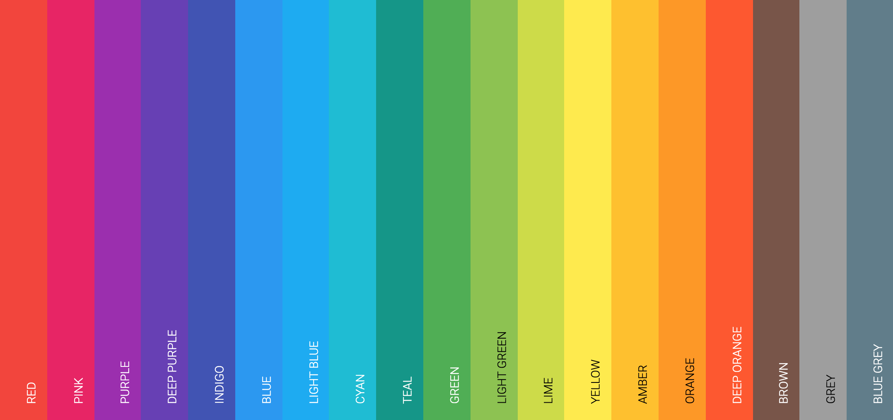

# material-colors-typescript

> **material-colors-typescript** 收集了来自 [Material Palette](https://www.materialpalette.com/colors) 的色值定义，并提供了 `toCCColor(hex_string:string):cc.Color` 来转换为 **Cocos Creator** 可用的 `cc.Color` 值。



## 示例

```js
import {Colors, toCCColor} from "path/to/Colors"
this.node.thistoCCColor(Colors.Red.A100)
```
